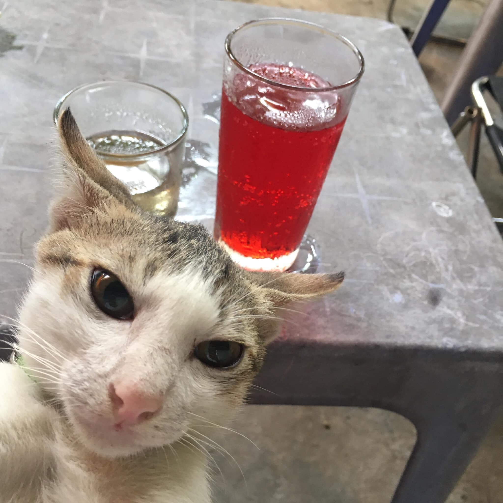

# Tiny-Qwen-VL Model (v1.4B)

- Total parameters: 1,380,450,994
- Model size: 2633.00 MB (2.57 GB)

This repository and its contents are provided for academic and research purposes only.

## Project Directory Structure

Below is the directory structure of the project:

```markdown
data/
    └── images/                          # for inference usage
        ├── dog_and_girl.jpeg
        ├── frame1.jpg
        ├── meowselfie.jpg
        └── untitled.jpg
notebooks/
    ├── rope2d_vs_abs_pos_embed.ipynb    # compare rope2d vs abs_pos_embed
    └── training-phase2.ipynb            # training logs - 4 epochs
src/
    ├── utils/
        ├── __init__.py
        ├── abs_pos_embed.py
        ├── rope2d.py
        └── vision_utils.py              # Adds image padding to prevent stretching
    ├── __init__.py
    ├── inference.py
    ├── model.py
    ├── preprocess.py                    # collate function to process data
    ├── train-phase1.py
    └── train-phase2.py
.gitignore
hf_download_ckpt.py                      # download checkpoints script
README.MD
requirements.txt
```

## Backbone Information

This repository hosts the checkpoint for the Tiny-Qwen-VL model, version 1.4B. The model architecture consists of the following components:

- **Vision Encoder**: based on the `google/siglip-so400m-patch14-224` architecture with vision embeddings of size 1152.

- **Position-Aware Adapter**: Utilizes learnable queries with a fixed length of 256, combined with a 2D Rotary Positional Embedding (RoPE) implementation to effectively encode positional information.

- **Text Decoder**: Utilizes the Qwen/Qwen2.5-0.5B architecture with text embeddings dimension of 896.

These components work in synergy to enable efficient multimodal learning and inference.

## Checkpoint

To download the pre-trained checkpoint, use the provided `hf_download_ckpt.py` script.

```bash
python hf_download_ckpt.py
```

## Important Notice

- `src/train-phase1.py` using image with size of 224x224.
- `src/train-phase2.py` using image with size of 448x448.

## Inference




### **Best model checkpoint in phase 2**
```bash
python src/inference.py \
    --best_model_path ./models/checkpoints/best_tinyqwenvl_1.4B-phase2.pth \
    --image_name meowselfie.jpg
```

### **Prompt & Output:**

```plaintext
Prompt:
Please carefully observe the image and come up with a caption for the image.

Generate 4 caption(s):

Caption 1:
A cat sitting on top of a white plate.
Caption 2:
A cat sitting on top of a table with a drink on it.
Caption 3:
A cat sitting on top of a white bowl with a spoon in it.
Caption 4:
A cat sitting on top of a table with a drink of water.
```

### **Best model checkpoint in phase 1**

```bash
python src/inference.py \
    --best_model_path ./models/checkpoints/best_tinyqwenvl_1.4B.pth \
    --image_name meowselfie.jpg
```

### **Prompt & Output:**

```plaintext
Prompt:
Please carefully observe the image and come up with a caption for the image.

Generate 4 caption(s):

Caption 1:
A woman in a red and white dress is walking down the street.
Caption 2:
A woman in a red and white dress is standing in front of a painting.
Caption 3:
A woman in a red and white dress is standing in front of a green and white car.
Caption 4:
A woman in a red and white dress is standing in front of a green and white car. The woman is holding a cellphone.
```

## Metrics Update

The CIDEr and SPICE scores will be added soon to provide a more comprehensive assessment of the model's performance.